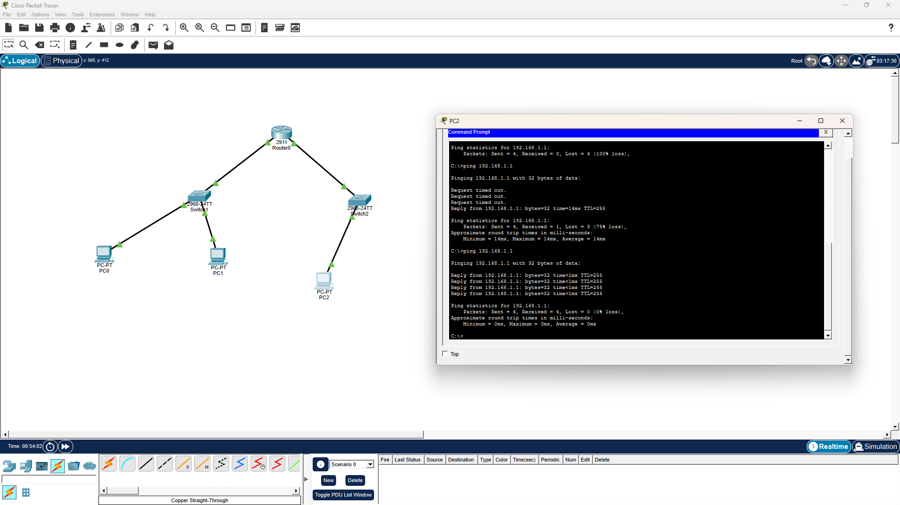

# Project 1: Understanding Network Communication

## Objective
Build a network from scratch and understand how devices communicate on the same network versus across different networks. This project demonstrates the fundamental difference between switches (Layer 2) and routers (Layer 3).

---

## Project Overview

This project started with a simple switch connecting two PCs, then expanded to include a third PC on a different network, which required adding a router to enable cross-network communication.

---

## Phase 1: Basic Switch Setup (Same Network)

### Topology
- 1 x Cisco 2960-24TT Switch
- 2 x Generic PCs (PC0, PC1)

### IP Addressing
| Device | IP Address | Subnet Mask | Network |
|--------|------------|-------------|---------|
| PC0    | 192.168.1.1 | 255.255.255.0 | 192.168.1.0/24 |
| PC1    | 192.168.1.2 | 255.255.255.0 | 192.168.1.0/24 |

### Connection
- PC0 → Switch (FastEthernet0/1)
- PC1 → Switch (FastEthernet0/2)

### Result
PC0 can ping PC1 successfully because they are on the same network

---

## Phase 2: Adding a Different Network (The Challenge)

### New Device
I added a third PC (PC2) on a different network:

| Device | IP Address | Subnet Mask | Network |
|--------|------------|-------------|---------|
| PC2    | 10.0.0.1   | 255.0.0.0   | 10.0.0.0/8 |

### The Problem
PC0 cannot ping PC2 → **Request timed out**

### Why Did This Happen?
- PC0 is on network `192.168.1.0`
- PC2 is on network `10.0.0.0`
- A **switch** operates at Layer 2 and only forwards traffic within the same network
- PC0 has no **default gateway** configured, so it doesn't know where to send packets destined for other networks

### Key Concept
> Switches connect devices within the same network.  
> Routers connect different networks together.

---

## Phase 3: Adding a Router (The Solution)

